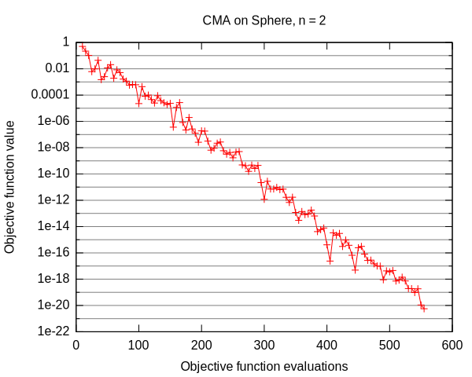
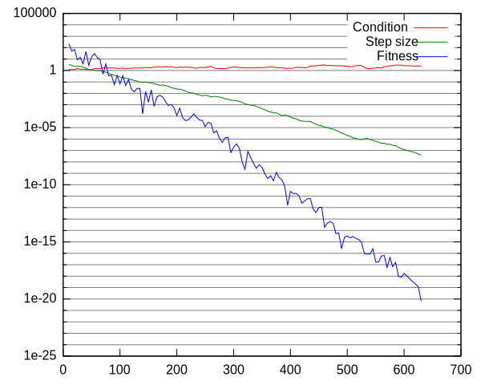

Covariance Matrix Adaptation Evolution Strategy
===============================================

The covariance matrix adaptation evolution strategy (CMA-ES) is one of
the most powerful evolutionary algorithms for single-objective
real-valued optimization. The algorithm relies on normally distributed
mutative steps to explore the search space while adjusting its
mutation distribution to make successful steps from the recent past
more likely in the future. In addition, a separate step-size is
maintained and adapted.

In Shark, we provide a reference implementation of the algorithm (see
:doxy:`CMA.h`) that is integrated with the optimizer class
hierarchy. Please note that our implementation is based on the
description given in [Hansen2004]_.

This tutorial illustrates applying the CMA-ES to the :doxy:`Sphere`
benchmark function. Please note that the methods presented here apply
to all single-objective optimizers available in the Shark
library. That is, applying an optimizer to an objective function
requires the following steps:

* Instantiate and configure the objective function.
* Instantiate the optimizer.
* Configure the optimizer instance for the objective function instance.
* Execute the optimizer until a termination criterion is fulfilled.

First of all, the following header files are required: ::

 // Implementation of the CMA-ES
 #include <shark/Algorithms/DirectSearch/CMA.h>
 // Access to benchmark functions
 #include <shark/ObjectiveFunctions/Benchmarks/Benchmarks.h>

Next, an instance of the objective function is created and configured
for a two-dimensional search space: ::

    shark::Sphere sphere;
    sphere.setNoVariables( 2 );

Thereafter, the optimizer is instantiated and initialized for the objective function instance: ::

    shark::detail::CMA cma;
    cma.init( sphere );

Here, we delegate the setup of constants and initialization of the
algorithm's state completely to the implementation. Nevertheless, the
class :doxy:`CMA` offers an additional init-method that allows for
fine grained control over the initial algorithm configuration. The method called before carries out the following steps:

* Sample a set of initial points from the objective function.
* Determine the median distance between the initial points.
* Estimate sensible values for mu and lambda.

Please see the following lines of code for the CMA implementation of these steps: ::

  RealVector initialPoints[3];
  function.proposeStartingPoint( initialPoints[0] );
  function.proposeStartingPoint( initialPoints[1] );
  function.proposeStartingPoint( initialPoints[2] );

  double d[3];
  d[0] = blas::norm_2( initialPoints[1] - initialPoints[0] );
  d[1] = blas::norm_2( initialPoints[2] - initialPoints[0] );
  d[2] = blas::norm_2( initialPoints[2] - initialPoints[1] );
  std::sort( d, d+3 );

  init( initialPoints[0].size(), // search space dimension
    CMA::suggestLambda( initialPoints[0].size() ), // get a suggestion for lambda
    CMA::suggestMu( // get a suggeston for mu
      CMA::suggestLambda( initialPoints[0].size() ), 
      m_chromosome.m_recombinationType 
    ),
    initialPoints[ 1 ], // pass in an initial point sampled from the objective function
    std::max( 1.0, d[1] ) // initial step size
  );

Subsequently, an initial iteration of the CMA-ES on the objective
instance is carried out. We store the result of the iteration in a
variable for later use: ::

    shark::TypedSolution<
	shark::Sphere::SearchPointType,
	shark::Sphere::ResultType
    > currentSolution = cma.step( sphere );

In general, the result of an iteration of a single-objective optimizer
is a tuple consisting of the best known search point and its
associated fitness.

Finally, we iterate the optimizer until the quality of the solution is good enough: ::

    while( currentSolution.objectiveFunctionValue() > 1E-20 ) {
	currentSolution = cma.step( sphere );
    }

Running the example and visualizing the results with the help of gnuplot will give you the following graphics: 

Please see the file :doxy:`CMASimple.cpp` for the complete source code of this tutorial.

Covariance Matrix Adaptation in Detail
--------------------------------------

In the example presented before, a very rough overview of the CMA, its
implementation in Shark and its application to an example problem has
been presented. We now dive into the algorithm in even more
detail. For the reaminder of the section, we assume the reader to be
familiar with the first part of the tutorial. Moreover, we assume an
audience that is familiar with the CMA-ES. 

First, we introduce the Probe framework, a unique part of Shark's core
architecture that allows for exporting values from within an algorithm
without the need to adjust its interface. It features a close-to-zero
overhead for reporting values to the outside world and an API that
delegates bookkeeping and setup tasks to sophisticated background
elements. In general, a probe is uniquely identified by its name and
the context it is living in. In the default implementation, a context
is assembled from a class-specific name (i.e., its type id) and a
class-instance specific UUID. A probe instance is observable for value
changes where the observer pattern is implemented in terms of
boost::signals.

The CMA implementation of the Shark library maintains five probes:

  =====================  ===========================================================================
    Probe name                    Probe description
  =====================  ===========================================================================
    Sigma                         Reports the step size sigma.
    PopulationMean                Reports the current population mean.
    WeigthVector                  Reports the current weight vector for weighted recombination.
    EvolutionPathC                Reports the evolution path for covariance matrix update purposes.
    EvolutionPathSigma	          Reports the evolution path for step size update purposes.
    CovarianceMatrix              Reports the current covariance matrix.
  =====================  ===========================================================================

Please note that the weighting vector stays constant. It is
initialized once for the selected recombination type according to the following formulas:

 =========================== ===============================================================================================================
  Recombination type                     Weigth calculation
 =========================== ===============================================================================================================
    shark::CMA::EQUAL         :math:`\forall 1 \leq i \leq \mu: w_i = 1/\mu`
    shark::CMA::LINEAR        :math:`\forall 1 \leq i \leq \mu: w'_i = \mu-i, w_i=\frac{w'_i}{\sum_{i=1}^{\mu} w'_i}`
    shark::CMA::SUPERLINEAR   :math:`\forall 1 \leq i \leq \mu: w'_i = \ln( \mu + 1. ) - \ln( 1. + i ), w_i=\frac{w'_i}{\sum_{i=1}^{\mu} w'_i}`
 =========================== ===============================================================================================================

Empirically Analyzing the CMA-ES
~~~~~~~~~~~~~~~~~~~~~~~~~~~~~~~~
In this section, usage of the probe framework for empirical algorithm analysis is illustrated.
First of all, the following header files are required: ::

  #include <shark/Core/Probe.h>
  #include <shark/Algorithms/DirectSearch/CMA.h>
  #include <shark/ObjectiveFunctions/Benchmarks/Benchmarks.h>

In this tutorial, results are written to two comma-separated values files, i.e.:

  * results.txt: Contains the numerical results of executing the CMA.
  * plot.txt: Contains gnuplot plotting commands for subsequent visualization purposes.

Moreover, we consider the Himmelblau fitness function (see http://en.wikipedia.org/wiki/Himmelblau%27s_function ).
As before, we start over with instantiating und configuring both the optimizer and the fitness function: ::

  // Instantiate both the problem and the optimizer.
  shark::Himmelblau hb;
  hb.setNoVariables( 2 );
  // Instantiate the optimizer.    
  shark::detail::CMA cma;
  // Initialize the optimizer for the objective function instance.
  cma.init( hb );

Next, we look up the probes provided by the CMA instance and connect it to a value store: ::

    // Instantiate the value store and get access to probes.
    shark::Store valueStore;
    shark::ProbeManager::ProbePtr populationMeanProbe = cma[ "PopulationMean" ];
    if( populationMeanProbe )
	populationMeanProbe->signalUpdated().connect( boost::bind( &shark::Store::operator(), boost::ref( valueStore ), _1, _2 ) );
    shark::ProbeManager::ProbePtr sigmaProbe = cma[ "Sigma" ];
    if( sigmaProbe )
	sigmaProbe->signalUpdated().connect( boost::bind( &shark::Store::operator(), boost::ref( valueStore ), _1, _2 ) );
    shark::ProbeManager::ProbePtr covarianceMatrixProbe = cma[ "CovarianceMatrix" ];
    if( covarianceMatrixProbe )
	covarianceMatrixProbe->signalUpdated().connect( boost::bind( &shark::Store::operator(), boost::ref( valueStore ), _1, _2 ) );

We only consider the probes reporting the population mean, the step
size sigma and the current covariance matrix in this tutorial. The
value store is a helper class that reacts to value changes, extracts
the correct data type and stores it for later use. Please see the file
:doxy:`CMAProbes.cpp` for further details.

Next, we iterate the CMA instance until a solution of sufficient quality is found: ::

    // Carry out an initial iteration of the optimizer.
    shark::TypedSolution<
	shark::Himmelblau::SearchPointType,
	shark::Himmelblau::ResultType
	> currentSolution = cma.step( hb );
	
    // Iterate the optimizer until a solution of sufficient quality is found.
    while( currentSolution.objectiveFunctionValue() > 1E-20 ) {

	currentSolution = cma.step( hb );

	...
    }

After every iteration of the algorithm, we extract the values of
interest from the value store and write them in an appropriate format
to the result files: ::

	// Report information on the optimizer state and the 
	// current solution to the result file.
	results << hb.evaluationCounter() << " " // Column 1
		<< valueStore.m_condition << " " // Column 2
		<< valueStore.m_sigma << " " // Column 3
		<< currentSolution.objectiveFunctionValue() << " "; // Column 4

	std::copy( 
		  currentSolution.searchPoint().begin(), // Column 5 & 6
		  currentSolution.searchPoint().end(), 
		  std::ostream_iterator< double >( results, " " ) 
		   );
	std::copy( 
		  valueStore.m_currentPopulationMean.begin(), // Column 7 & 8
		  valueStore.m_currentPopulationMean.end(), 
		  std::ostream_iterator< double >( results, " " ) 
		   );
	results << std::endl;

Please note that the current solution is not equal to the population
mean reported by the CMA instance as the population mean is the result
of the recombination operator applied to the respective parent
population.

Finally, we present the results of the example in the following plot:

References 
^^^^^^^^^^

.. [Hansen2004] N. Hansen and S. Kern. Evaluating the CMA Evolution Strategy on Multimodal Test Functions. In Eighth International Conference on Parallel Problem Solving from Nature PPSN VIII, Proceedings, pp. 282-291, Berlin: Springer, 2004.
