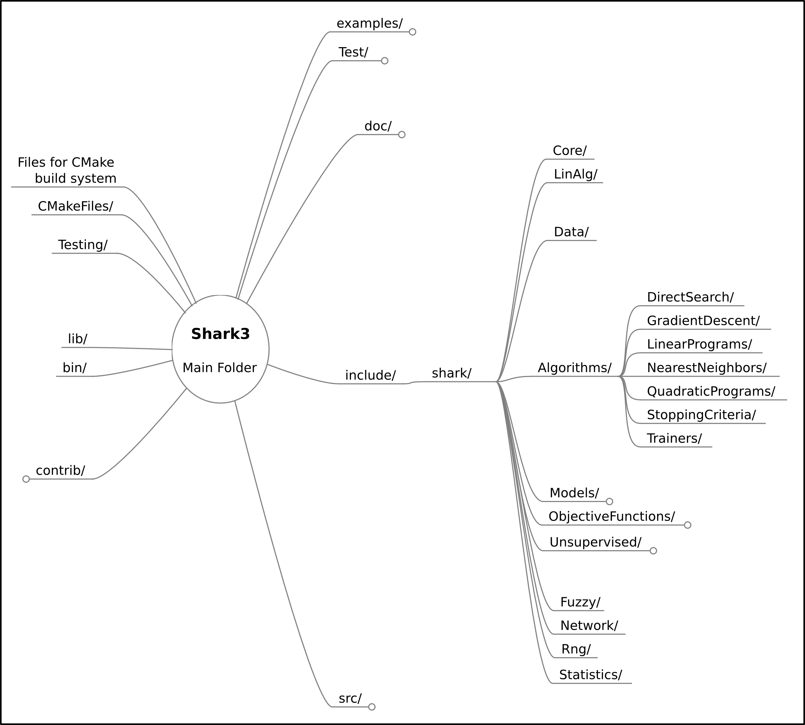

Your Shark Programs
===================

In order to use the Shark library's functionality, you will usually write your own (short or long)
C++ programs, which will link against the Shark library. We below give example configurations for two
popular options, standard Makefiles and CMake configuration files.

Working with plain Makefiles
****************************

A very basic Linux/MacOS Makefile for building a program using Shark may look like this: ::

   SHARK_ROOT = /Users/Aizerman/Shark
   CPPFLAGS   =  -I${BOOST_ROOT} -I${SHARK_ROOT}/include -Wall
   CPPFLAGS  += -DNDEBUG -DBOOST_UBLAS_NDEBUG  -O3
   LDFLAGS   += -L${SHARK_ROOT}/lib/ -L${BOOST_ROOT}/lib
   LDLIBS     = -lshark
   LDLIBS    += -lboost_serialization -lboost_system -lboost_filesystem -lboost_program_options
   CC         =  g++

The environment variable SHARK_ROOT must be set by the user and must
point to where Shark has been installed.

It is assumed that the include files for the Boost library are in the
directory specified by the environment variable BOOST_ROOT and that
the Boost libraries are in BOOST_ROOT/lib .

We link against some Boost libraries. Usually only ``-lboost_serialization`` is required.
Depending on what you do with
Shark, more Boost libraries may be required. Note that the Boost
libraries must be found by the executable. That is, you may need to
adjust your DYLD_LIBRARY_PATH under MacOS or your LD_LIBRARY_PATH on
other Unix-based systems: ::

   export DYLD_LIBRARY_PATH=${BOOST_ROOT}/lib:${DYLD_LIBRARY_PATH}

Now, to compile the source code MySharkExample.cpp just type: ::

   make MySharkExample

The above Makefile builds your code in ``Release`` mode. (Also see
:doc:`../../getting_started/installation` for configuring the build
options of the main library [not your application programs].)

Sometimes, the boost libraries have an additional suffix, in
particular ``-mt`` for multi-threaded versions. You have to adapt your
Makefile accordingly: ::

   LDLIBS    += -lboost_serialization-mt -lboost_system-mt -lboost_filesystem-mt -lboost_program_options-mt

.. warning::
   If you build your release version without the proper compiler options
   (``-O3 -DNDEBUG -DBOOST_UBLAS_NDEBUG``), your program will be slowed
   down *dramatically*. However, we do recommend to test a (subset of a)
   new program in debug version first to ensure that no important checks
   are violated.

A ``Debug`` version may look like this: ::

   SHARK_ROOT = /Users/Aizerman/Shark
   CPPFLAGS   = -I${BOOST_ROOT} -I${SHARK_ROOT}/include -Wall
   CPPFLAGS  += -DDEBUG -g
   LDFLAGS   += -L${SHARK_ROOT}/lib/ -L${BOOST_ROOT}/lib
   LDLIBS     = -lshark_debug
   LDLIBS    += -lboost_serialization -lboost_system -lboost_filesystem -lboost_program_options
   CC         =  g++

That is, we now use the debug version of the Shark library
``shark_debug``, which must have been installed/built, and pass
different options to the compiler (line 3).

.. _label_for_cmake_example_project:

Working with CMake
******************

Alternatively, CMake can also be used for application projects using
Shark.  We provide an example CMakeLists.txt for your convenience.
Try to compile one of the Shark examples with it first. This ensures
that your installation is working.

You can find the template CMakeLists.txt in your example folder at ``ExampleProject/CMakeLists.txt`` .
It automatically links to all libraries used by your Shark build configuration. Just add your files
to the project and run cmake.

Shark directory layout
***********************

The below diagram gives an overview over the Shark directory structure
after *having extracted the source code package of shark*.

.. todo::
  is this still up to date?

.. note::
   The locations and/or contents of the listed folders may
   differ for the pre-compiled binary packages and installers. The contents
   of the ``include/`` folder however, are the same across all installation
   packages.

The ``include/`` folder's structure well mirrors the Shark library's design
choices:

* The ``Core/`` Folder provides basic interfaces and functionality
  for math and other utility functions in shark.
* In ``LinAlg/``, basic vector and matrix functionality is implemented
  (e.g., by wrapping the Boost C++ uBLAS libraries).
* The ``Data/`` folder for example provides import/export routines,
  and also sets up a :doxy:`Data` class especially suited for
  machine learning tasks: subsets (e.g., for cross-validation) are
  lazy copies of the original set.
* The folders ``Fuzzy/``, ``Network/``, ``Rng/``, ``Statistics/`` all
  implement specialized functionality pertaining to Fuzzy Logic, HTTP
  protocols (for RESTful APIs), random number generation, and various
  statistical tests or distributions, respectively.

* Currently, the only algorithms implemented in the folder ``Unsupervised/``
  are Restricted Boltzmann machines, but this will be expanded in the future.

* Finally, one of the most important design aspects of Shark is the
  ``"Model"``-``"ObjectiveFunction"``-``"Optimizer"`` trias. This can be seen as roughly
  corresponding to the three remaining folders ``Models/``, ``ObjectiveFunctions/``,
  and ``Algorithms/``
