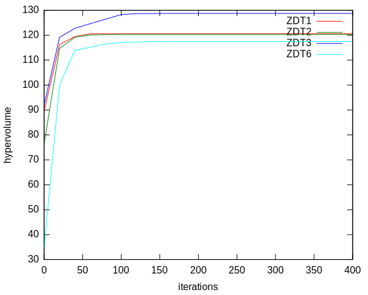

Creating Multi-Objective Benchmarks with Shark
===============================================================

This is short tutorial on how to use Shark to develop a simple Benchmark.
It is intended to give a starting point to develop experimental designs.
This tutorial is based on the :doxy:`MOCMAExperiment.cpp`, which includes a
complete implementation of this tutorial.

Shark comes with a basic set of multi-objective algorithms including the reference
implementation of the MO-CMA-ES. Moreover, Shark includes a big set of standard
multi-objective benchmark functions. The best known are the ZDT, DTLZ, IHR and
LZ families of functions. All benchmarks are located in "ObjectiveFunctions/Benchmarks".

In the following we will describe a standard setup to evaluate the MO-CMA-ES on
some of the ZDT-functions. It is not an easy task to evaluate the quality 
of a solution of a multi-objective function - we have to evaluate how good the 
points approximate the optimal pareto-front. Instead of doing this directly, we
will measure the hypervolume covered by the points with respect to a reference point. 
Optimal results are known for `some benchmarks  <http://www.tik.ee.ethz.ch/sop/download/supplementary/testproblems/>`_.
We will repeatedly optimize the function and periodically calculate the covered hypervolume. In the end we calculate
the mean hypervolume covered by the solution.

We start with the includes we need for this example::

	// Implementation of the MO-CMA-ES
	#include <shark/Algorithms/DirectSearch/MOCMA.h>
	// Access to benchmark functions
	#include <shark/ObjectiveFunctions/Benchmarks/ZDT1.h>
	#include <shark/ObjectiveFunctions/Benchmarks/ZDT2.h>
	#include <shark/ObjectiveFunctions/Benchmarks/ZDT3.h>
	#include <shark/ObjectiveFunctions/Benchmarks/ZDT6.h>
			
	using namespace shark;
	using namespace shark::benchmarks;
	

The first question is how to measure the hypervolume. This is easy as shark comes with an algorithm for it.
We only have to tell it how to extract the points from the solution object of the MO-CMA and choose a reference point.
We will use the same reference as the one used for the analytic results for better comparison::

	template<class Solution>
	double hypervolume( Solution const& solution){
		// the reference point (11,11).
		RealVector referencePoint(2,11);
		//instance of the hypervolume calculator
		HypervolumeCalculator hypervolume;
		auto toPoints = {return point.value;};
		return hypervolume(boost::adaptors::transform(solution,toPoints),referencePoint);
	}
	

Next we set the experimental parameters::

		std::size_t frontSize = 10; //number of points that approximate the front
		std::size_t numDimensions = 10; //dimensions of the objective functions
		std::size_t numTrials = 10; // how often the optimization is repeated
		std::size_t recordingInterval = 20; //we want to record after some multiple of this
		std::size_t numIterations = 20*recordingInterval; //number of iterations to perform
	

and create a vector of test functions::

		//assortment of test functions
		typedef boost::shared_ptr<MultiObjectiveFunction> Function;
		std::vector<Function > functions;
		functions.push_back(Function(new ZDT1(numDimensions)));
		functions.push_back(Function(new ZDT2(numDimensions)));
		functions.push_back(Function(new ZDT3(numDimensions)));
		functions.push_back(Function(new ZDT6(numDimensions)));
	

The next block describes the experiment itself. Every function is optimized seperately. At the beginning of a trial,
the MO-CMA is created and initialized, which will create an initial solution. 
The hypervolume of this solution is calculated before starting the optimization process which runs
for the desired amount of iterations. The hypervolume values are accumulated in the matrix `meanVolumes`. After the optimization is finished,
the accumulated sums are divided by the number of trials to get the mean::

		RealMatrix meanVolumes(functions.size(), numIterations/recordingInterval+1,0.0);
		for(std::size_t f = 0; f != functions.size(); ++f){
			for(std::size_t trial = 0; trial != numTrials; ++trial){
				//print progress
				std::cout<<"\r" <<functions[f]->name() <<": "<<trial<<"/"<<numTrials<<std::flush;
				//create and initialize the optimizer
				MOCMA mocma;
				mocma.mu() = frontSize;
				functions[f]->init();
				mocma.init( *functions[f] );
				
				//record and hypervolume of initial solution
				meanVolumes(f,0) += hypervolume(mocma.solution()); 
				
				//optimize
				for(std::size_t i = 1; i <= numIterations; ++i){
					mocma.step(*functions[f]);
					if(i % recordingInterval == 0){
						meanVolumes(f,i / recordingInterval) += hypervolume(mocma.solution()); 
					}
				}
			}
		}
		meanVolumes /= numTrials;
	

And we finally print the solution table together with a small legend::

		std::cout<<"\r# Iteration ";
		for(std::size_t f = 0; f != functions.size(); ++f)
			std::cout<<functions[f]->name()<<" ";
		std::cout<<"\n";
		
		std::cout.precision( 7 );
		for(std::size_t i = 0; i != meanVolumes.size2();++i){
			std::cout<< i*recordingInterval<<" ";
			for(std::size_t f = 0; f != functions.size(); ++f){
				std::cout<<meanVolumes(f,i)<<" ";
			}
			std::cout<<"\n";
		}
	

We can plot this with a simple gnuplot script which results in:

