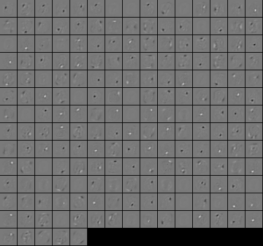

Autoencoders
==============================================

An autoencoder is a feed forward neural network which is trained to map
its input to itself via the representation formed by the hidden units. The optimisation
problem for input data :math:`\vec{x}_1,\dots,\vec{x}_N` is stated as:

.. math ::
	\min_{\theta} \frac 1 N \sum_{i=1}^N (\vec x_i - f_{\theta}(\vec x_i))^2 \enspace .

Of course, without any constraints this is a simple task as the model
will just try to learn the identity. It becomes a bit more challenging
when we restrict the size of the intermediate representation (i.e.,
the number of hidden units). An image with several hundred input
points can not be squeezed in a representation of a few hidden
neurons. Thus, it is assumed that this intermediate representation
learns something meaningful about the problem.  Of course, using this
simple technique without any additional regularization
only works if the number of hidden neurons is smaller than
the number of dimensions of the image.

As a dataset for this tutorial, we use a subset of the MNIST dataset which needs to
be unzipped first. It can be found in ``examples/Supervised/data/mnist_subset.zip``.
The full example program can be found in  :doxy:`AutoEncoderTutorial.cpp`.

The following includes are needed for this tutorial::

	#include <shark/Data/Pgm.h> //for exporting the learned filters
	#include <shark/Data/SparseData.h>//for reading in the images as sparseData/Libsvm format
	#include <shark/Models/LinearModel.h>//single dense layer
	#include <shark/Models/ConcatenatedModel.h>//for stacking layers
	#include <shark/ObjectiveFunctions/ErrorFunction.h> //the error function for minibatch training
	#include <shark/Algorithms/GradientDescent/Adam.h>// The Adam optimization algorithm
	#include <shark/ObjectiveFunctions/Loss/SquaredLoss.h> // squared loss used for regression
	#include <shark/ObjectiveFunctions/Regularizer.h> //L2 regulariziation
	

Training autoencoders
^^^^^^^^^^^^^^^^^^^^^^^^^^^^^^^^

Training an autoencoder is straight forward in shark. We just setup two neural networks,
one for encoding and one for decoding. Those are then concatenated to form one autoencoder
network::

		//We use a dense lienar model with rectifier activations
		typedef LinearModel<RealVector, RectifierNeuron> DenseLayer;
		
		//build encoder network
		DenseLayer encoder1(inputs,hidden1);
		DenseLayer encoder2(encoder1.outputShape(),hidden2);
		auto encoder = encoder1 >> encoder2;
		
		//build decoder network
		DenseLayer decoder1(encoder2.outputShape(), encoder2.inputShape());
		DenseLayer decoder2(encoder1.outputShape(), encoder1.inputShape());
		auto decoder = decoder1 >> decoder2;
		
		//Setup autoencoder model
		auto autoencoder = encoder >> decoder;
	
Note that for the deeper layers we use the shape of the output of the 
previous layers (in this case just a 1-d shape with the number of neurons) to
specify the shape of the input of the next layer.

Next, we set up the objective function. This should by now be looking
quite familiar.  We set up an :doxy:`ErrorFunction` with the model and
the squared loss. Here we enable minibatch training to speed up 
the training progress.
We create the :doxy:`LabeledData` object from the
input data by setting the labels to be the same as the inputs. Finally
we add  two-norm regularisation by creating an instance of the
:doxy:`TwoNormRegularizer` class::

		//create the objective function as a regression problem
		LabeledData<RealVector,RealVector> trainSet(data.inputs(),data.inputs());//labels identical to inputs
		SquaredLoss<RealVector> loss;
		ErrorFunction<> error(trainSet, &autoencoder, &loss, true);//we enable minibatch learning
		TwoNormRegularizer<> regularizer(error.numberOfVariables());
		error.setRegularizer(regularisation,&regularizer);
		initRandomNormal(autoencoder,0.01);
	

Lastly, we optimize the objective using :doxy:`Adam`::

		Adam<> optimizer;
		error.init();
		optimizer.init(error);
		std::cout<<"Optimizing model "<<std::endl;
		for(std::size_t i = 0; i != iterations; ++i){
			optimizer.step(error);
			if(i  % 100 == 0)
				std::cout<<i<<" "<<optimizer.solution().value<<std::endl;
		}
		autoencoder.setParameterVector(optimizer.solution().point);
	

Visualizing the autoencoder
^^^^^^^^^^^^^^^^^^^^^^^^^^^

After training the different architectures, we printed the feature maps of the first layer
(i.e., the input weights of the hidden neurons ordered according to the pixels they are connected to). Let's have a look.

		exportFiltersToPGMGrid("features",encoder1.matrix(),28,28);
	

What next?
^^^^^^^^^^^^^^^^^^^^^^^^^^^
The next tutorials covers :doc:`variational_autoencoders`